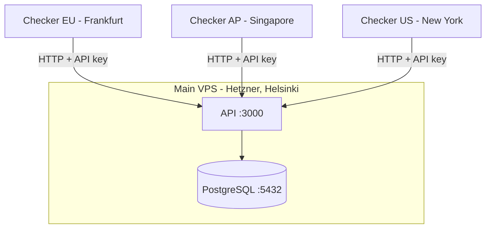

# Argus

A small distributed service monitor I'm building as a portfolio backend development project. The real goal is to learn how a distributed system actually fits together - multi-region checks, consensus, anomaly detection, SLA reporting.

I'm building it phase by phase. Each phase tries to do one thing. Whenever I face limitations, I plan to improve it in the next phase. New features show up when I notice the previous version isn't enough.

## Status

| Phase | Features |
|---|---|
| [Phase 0 - Foundations](#phase-0--foundations) | Monorepo, Fastify API, structured logging, RFC 7807 errors, multi-stage Docker, CI |
| [Phase 1 - Single Checker MVP](#phase-1--single-checker-mvp) | Monitor CRUD, in-process checker, partitioned results, ntfy.sh alerts |
| [Phase 2 - Three Real Checkers](#phase-2--three-real-checkers) | Independent checker processes across 3 regions, API key auth, per-checker alerting |
| [Phase 3 - Windowed Consensus](#phase-3--windowed-consensus) | 2-of-3 majority voting over a 90s window, advisory-lock serialised evaluation, alerts on consensus transitions |
| [Phase 4 - State Machine with Flap Suppression](#phase-4--state-machine-with-flap-suppression) | Four-state machine with time-based thresholds, append-only `status_events`, pg-boss alert queue, alerts on state transitions |
| [Phase 5 - EWMA Latency Anomaly Detection](#phase-5--ewma-latency-anomaly-detection) | Online EWMA baseline + z-score, `anomaly_events` log, slow-response alerts via existing pg-boss queue |
| [Phase 6 - SLA, SLO, and Error Budget](#phase-6--sla-slo-and-error-budget) | Uptime from the FSM audit log, maintenance windows and coverage gaps excluded, optional SLO error budget |
| [Phase 7 - Per-Checker Anomaly and Demo Hardening](#phase-7--per-checker-anomaly-and-demo-hardening) | Per-checker EWMA baselines, transactional alert outbox, scheduled jobs, SSRF guard, rate limiting, self-service demo tokens |

## Architecture



Each checker runs independently - its own scheduler, its own heartbeat loop, its own network path. Results are POSTed to the API as they happen. No coordination between checkers.

## Stack

Node 24 LTS, TypeScript 6 strict, ESM throughout. Fastify, Postgres 17 with raw `pg` (no ORM), Pino, Biome (format + lint), `node-pg-migrate`, multi-stage Docker, GitHub Actions, Husky + commitlint.

## Running locally

Requires Docker Desktop and Node 24.

```bash
git clone https://github.com/YOUR_USERNAME/argus.git
cd argus
docker compose up --build
```

Brings up Postgres, the API on `localhost:3000` (`/health`, `/ready`), and a local checker instance.

---

## Benchmarks

### Phase 3 ΓÇö consensus suppresses a noisy checker

Target: my Vercel-hosted dev site, monitored by all three checkers at 60s intervals. Impaired `checker-eu` by dropping forwarded TCP 443 from its container for 45s out of every 90s (20 cycles, 30 min). Other two checkers untouched.

| Window           | checker-eu down  | Consensus verdicts | Alerts fired |
|------------------|------------------|--------------------|--------------|
| Control (15 min) | 0 / 15 (0.0%)    | 45 up / 0 down     | 0            |
| Lossy   (30 min) | 10 / 30 (33.3%)  | 105 up / 0 down    | 0            |

All 10 failures were clean 10s `AbortSignal` timeouts. Phase 2 per-checker alerting would have produced ~10 false-positive DOWN+RECOVERED pairs over the same window.

### Phase 4 ΓÇö flap suppression

Target: a controllable `fake-target` server on the checker-eu droplet, monitored by all three checkers at 30s intervals with `down_threshold_seconds=60` and `recovery_threshold_seconds=60` (so the machine declares DOWN after two consecutive `down` checks and recovers after two `up`). Two runs of 100 flap cycles each, scripted with `tools/flap-script.sh`. "Consensus edges" is the alert count the previous phase's consensus-edge alerting would have produced over the same traffic.

| Run | Cycles | Fail / OK phase | Consensus edges | DOWN alerts | RECOVERED alerts |
|-----|--------|-----------------|-----------------|-------------|------------------|
| Sustained outages | 100 | 20s / 20s | 295 | 72 | 72 |
| Sub-threshold flap | 100 | 10s / 10s | 199 | **0** | **0** |

In the sustained run each 20s failure phase was long enough for two consecutive checks to both observe it, so 72 of the cycles became genuine outages. The state machine collapsed each outage's `up → degraded → down` churn into a single DOWN+RECOVERED pair: 295 consensus edges became 144 alerts.

In the sub-threshold run each 10s failure phase was too short for two consecutive 30s checks to both catch it. All 99 observed failures entered DEGRADED and slid back to UP silently - zero crossed the threshold, zero alerts fired, against 199 consensus edges the old path would have alerted on. That is the phase: transient flap produces no alerts at all.

### Phase 5 ΓÇö EWMA latency anomaly

Target: `http://138.68.109.43:7070/` (same `fake-target` as Phase 4), monitored by all three checkers at 30s intervals. Driver: `tools/slow-script.sh` flips `/control/slow/400`, waits 120s, then `/control/ok`.

The baseline was warmed naturally - the monitor had been running against the live target long past the 30-sample warm-up gate, so at injection it held 342 samples at ~168ms with σ≈7.9. That baseline is the genuine steady-state consensus median across the three regions (Frankfurt's low RTT plus Singapore/New York at ~300ms), not a hand-picked number.

Bench run (2026-06-14 UTC): `/control/slow/400` at 20:45:40, `/control/ok` at 20:47:42.

| Metric | Target | Actual |
|--------|--------|--------|
| Baseline EWMA before inject | natural warm-up | ~168ms, σ≈7.9, 342 samples |
| Cycles to SLOW alert (post-inject) | Γëñ ~3 | **~1** (first row ~4s, alert ~6s) |
| Firing z-score (post-inject) | > 3 | **21.11** (median 322ms vs baseline 163) |
| `monitors.status` during anomaly | `up` | **up** |
| Post-recovery anomalies (120s window) | clears | **0 rows** |
| Alert category | SLOW, not DOWN | **yes** (`kind: anomaly`, turtle tag) |

`duration_ms` on an anomaly row is the consensus **median** across three checkers, not the 400ms `/control/slow/` floor - Frankfurt adds ~400ms to a low RTT, Singapore/New York add ~400ms on top of ~300ms RTT, so the median lands between them (~320ΓÇô570ms over the slow phase).

Two honest readings from the live data:

- **The 3σ rule is twitchy on a tight baseline.** Before injection, with σ as small as ~3.9, a 14ms jitter (163→177ms) crossed z=3 and fired a SLOW alert. A fixed multiplier over-fires when the variance is genuinely small.
- **A sustained slowdown self-quiets.** The first slow reading screamed (z=21.1), but each subsequent slow reading folded into the EWMA - the baseline climbed 163→187→223ms and σ blew out 7.5→62→110, so z fell to 3.9 then 3.2 within three cycles. The detector is loud on the *onset* of a step change and progressively deaf to it once the baseline chases the new level. By bench end the EWMA sat at ~179ms, drifting back toward steady state.

### Phase 6 ΓÇö SLA from the FSM audit log

The SLA endpoint reads, it doesn't measure new traffic, so the bench replays a window with known ground truth: the Phase 4 sustained-outage run (72 declared outages over ~67 minutes), turned into an uptime number from the same `status_events`.

Window: `2026-06-07T03:31:13Z` → `04:37:57Z` (~66.7 min).

| Metric | Value |
|--------|-------|
| Incidents (FSM `down` periods) | 72 |
| Downtime | 21.38 min |
| Coverage gaps excluded | 0.49 min (<1%) |
| Uptime | 67.73% |
| `lowConfidence` | false |

The 72 incidents match the 72 DOWN alerts Phase 4 recorded over the same run - the timeline reconstructs the outages from the transition log alone, counting only `down` time. Scheduling a maintenance window over one outage drops its downtime to zero and moves those minutes into `maintenanceMinutes`. Adding `slo=99.9` shows the ~4s budget for a 66-minute window burned many times over by ~21 minutes of downtime; `slo=50` flips `met` to true.

---

## Engineering Ledger

A running record of decisions I made each phase. Entries stay as-written when later phases ship; the log captures the reasoning at the time, not retrospective tidying.

### Phase 0 - Foundations

**Focus:** A deployable backend spine before any feature work. Strict TypeScript, structured logging, RFC 7807 errors, multi-stage Docker, and CI from day one.

**What's in place:**

- npm monorepo with four workspaces: `apps/api`, `apps/checker`, `packages/db`, `packages/logger`
- TypeScript 6 strict (`noUncheckedIndexedAccess`, `noImplicitOverride`), ESM throughout
- Fastify API with `/health` and `/ready`; global error handler emits RFC 7807 with request IDs
- Custom `ArgusError` class hierarchy for typed exceptions (`NotFoundError`, `ValidationError`, etc.)
- Pino structured logging with `service` and `env` base fields across all packages
- `withTransaction` helper in `@argus/db` to keep BEGIN/COMMIT out of route handlers
- Multi-stage Docker, both images under 200MB, non-root user
- Docker Compose with healthcheck-ordered startup
- GitHub Actions CI: build & lint, Docker build, smoke test against the built image
- Branch protection; Conventional Commits enforced via Husky + commitlint

**Key decisions and tricky bugs:**

- `pg.Pool` emits an `'error'` event on top of rejecting the query promise when the database disappears. Without a listener, Node treats it as unhandled and crashes the process - bypassing the try/catch inside `ping()`. Added a no-op `pool.on('error', ...)` listener to absorb pool-level errors; query-level errors still propagate to callers.
- `npm run build --workspaces` doesn't respect topological order, so `apps/api` failed to compile in CI before `packages/db` had emitted its `.d.ts` files. Resolved with explicit build ordering in the root script rather than introducing TypeScript project references - `composite: true` setup felt heavy for four workspaces, but I will change it if the project monorepo grows noticeably.
- Each package owns its own environment variables. The API never reads `DATABASE_URL` directly; importing `@argus/db` triggers validation. Avoids duplicated `requireEnv` helpers and keeps the per-package contract explicit.

### Phase 1 - Single Checker MVP

**Focus:** First real feature: a working uptime monitor with push alerts via ntfy.sh. Monitor CRUD routes, an in-process checker scheduled with `setInterval`, and partitioned `check_results` storage.

**What's in place:**

- Monitor CRUD API with Fastify JSON Schema validation and RFC 7807 errors
- `monitors` table with `CHECK (interval_seconds BETWEEN 30 AND 3600)`; `check_results` partitioned by month with current and next month partitions created at migration time
- In-process checker: `setInterval` per monitor, reseeds from DB on startup, resyncs every 60 seconds
- Error classification on fetch failures: `timeout`, `dns_failure`, `connection_refused`, `tls_error`, `http_error`, `network_error` - reads `err.cause.code` not `err.code` because Node's fetch wraps syscall errors in a TypeError
- Alerts on every upΓåödown transition via ntfy.sh - best-effort, failures logged as warn and never propagated
- Integration tests for all query functions and routes via testcontainers (real Postgres, no mocks)

**Key decisions and tricky bugs:**

- Used `setInterval` instead of pg-boss `schedule`. pg-boss cron has a one-minute minimum granularity; `setInterval` is simpler and has no scheduling overhead for a single-process checker.
- Added `resetPool(connectionString)` to `@argus/db` so integration tests can swap the pool to point at the testcontainers Postgres after module load - only called by tests, never in production.

**Limitations of this phase:**

- Alerting fires on every transition with no debouncing. A 3-second blip produces a DOWN alert and immediately a RECOVERED alert.
- One checker, one network path. A local network issue is indistinguishable from the target being down.
- Partition rollover is manual - partitions are created at migration time. Running out of partitions will cause inserts to fail.
- Authentication is a hardcoded `MONITOR_USER_ID` env var - no real auth.

### Phase 2 - Three Real Checkers

**Focus:** Replaced the in-process checker with three independent checker processes running in Frankfurt, Singapore, and New York. Main VPS on Hetzner, checker droplets on DigitalOcean. Three regions, genuinely independent network paths.

**What's in place:**

- `apps/checker` - standalone Node process. Polls `/internal/checkers/:id/monitors` every 60s, schedules a check per monitor via `setInterval`, POSTs results to `/internal/results`, heartbeats every 60s
- `/internal/*` API surface authenticated with SHA-256-hashed API keys (`X-API-Key` header). One key per checker, scoped to `checker:write`. URL `checkerId` cross-checked against the key's `owner` to prevent impersonation
- `checker_heartbeats` table, partitioned monthly. `api_keys` table with soft-revoke
- `tools/mint-api-key.ts` CLI for issuing new checker keys
- Three independent deploys, parallel matrix in GitHub Actions, one per region. One region failing doesn't block the others
- CI split into parallel `docker-api` and `docker-checker` jobs with scoped GHA cache; `smoke` only waits on `docker-api`

**Key decisions and tricky bugs:**

- SHA-256 for API key hashing instead of bcrypt. API keys are high-entropy random strings - bcrypt's per-row cost is unnecessary and makes key lookup O(n). SHA-256 + unique index gives O(1) lookup with no meaningful brute-force risk given 131-bit entropy keys.
- Removed `app.checker.scheduleMonitor()` calls from the monitor CRUD routes. The real checkers resync every 60s - up to a 60s lag between creating a monitor and the first check is acceptable. Instant scheduling was only needed when the scheduler lived in-process.
- Migrations run inside a throwaway Docker container on the `infra_default` network so the `postgres` hostname resolves correctly. Running `node-pg-migrate` directly on the VPS host fails because the `postgres` hostname is internal to Docker.

**Limitations of this phase:**

- Alerting is per-checker. `checker-eu` reporting DOWN produces one alert; `checker-ap` reporting DOWN produces another. The user does the consensus mentally.
- No retry on a failed `/internal/results` POST. A transient network error drops one data point. Acceptable for an uptime monitor at this scale.
- API key revocation requires running SQL directly on the prod DB. No admin UI.
- Every checker polls every monitor. No sharding or per-region assignment.
- Partition rollover for `check_results` and `checker_heartbeats` is a manual script.
- API traffic is HTTP, not HTTPS. The API port is firewalled on the main VPS to the three checker droplet IPs only (ufw + `ufw-docker` to handle Docker's iptables bypass), so the API key crosses three known point-to-point links rather than the open internet - but it is not encrypted in transit. Adding Caddy + Let's Encrypt is blocked on owning a domain; tracked as the next thing to fix when that lands.

### Phase 3 - Windowed Consensus

**Focus:** A check verdict is decided by majority agreement across checkers within a recent time window, not by whichever checker wrote last. One checker having a bad network path no longer produces alerts on its own.

**What's in place:**

- `evaluateConsensus` runs on every result write. Takes a per-monitor `pg_try_advisory_xact_lock(hashtext(monitor_id))`, reads the most-recent result per checker within a 90-second window (`DISTINCT ON (checker_id)`), intersects with checkers that heartbeated in the last 2 minutes, and computes a verdict: `up` / `down` / `degraded` / `insufficient_data`
- Majority rule: with 3 checkers, 2-of-3 decides. With 2, only a unanimous pair is callable - a split is `degraded`. With 1, the lone vote stands at low confidence
- Verdict persisted to a denormalised `monitors.last_consensus`; surfaced on `GET /v1/monitors/:id` via a Fastify response schema that whitelists public fields
- Alerts moved from per-checker to per-consensus-edge. One DOWN ntfy per real `up→down` cross-checker transition, one RECOVERED per `down→up`. Phase 2's `maybeAlert` and `getLastTwoResultsForChecker` deleted
- Pure `computeConsensus` (unit-tested with literal `WindowResult[]`) split from `evaluateConsensus` (the lock + queries + persist + log shell, integration-tested against a real Postgres via testcontainers)
- Lock contention skips rather than queues: if a second evaluation for the same monitor can't acquire the lock it returns `null` and the next result write re-evaluates

**Key decisions and tricky bugs:**

- Window is 90 seconds, wider than the 60s default check interval. A 60s window would have dropped any checker even slightly late; 90s gives a slow result time to land and tolerates one missed cycle.
- Added a second column `last_alertable_consensus` that only records `up`/`down`. The alert-edge check reads this column, not `last_consensus`. Without it, a transient `up → degraded → down` would have silently consumed the real transition - `degraded` would have overwritten `up` in `last_consensus` and the alert function would have treated `degraded → down` as a first-evaluation and stayed quiet.
- `medianDurationMs` is `number | null`, never `0`. A `0` reads as "responded in 0ms" to anything that later consumes it as a real measurement.
- Heartbeat intersection, not just the window. A checker that wrote a result then died mid-window has its vote dropped - the data is stale and a dead checker shouldn't keep voting.
- `pg_try_advisory_xact_lock` is the right primitive: `_try_` so contention skips rather than queues, `_xact_` so the lock auto-releases on COMMIT/ROLLBACK and can't leak. Both consensus queries and the UPDATE take `PoolClient` as their first parameter so the type system enforces "run on the same connection that holds the lock" - using the module-level `query` helper would silently grab a different pooled connection.
- `evaluateConsensus` runs in a separate transaction from `insertCheckResult`. The insert commits first so the new row is visible to the consensus window query.
- First-evaluation rule: a brand-new monitor whose target is already down does not alert until it has first recorded an `up`. Stops noisy alerts on creation when a target happens to be broken at the moment a monitor is added.

**Limitations of this phase:**

- This is majority voting, not consensus in the Paxos/Raft sense. No leader election, no log replication. Tolerates one checker failing or having a bad network path; would not survive two simultaneous failures.
- Alerts still fire on every consensus change. A genuinely flapping service - one that really does bounce up/down every 30 seconds - produces an alert per bounce. Removed single-checker false positives but does not yet debounce real flap.
- The 90-second window has an edge. A checker slow enough to land its result *outside* the window gets evaluated with one fewer vote - a 3-checker monitor momentarily decided 2-of-2.
- No consensus history. Only the latest verdict is stored, in two denormalised columns. `check_results` remains the source of truth and historical verdicts have to be recomputed.

### Phase 4 - State Machine with Flap Suppression

**Focus:** Alerts fire on real state transitions, not on every consensus edge. A four-state machine - UP / DEGRADED / DOWN / RECOVERING - sits between the consensus verdict and the alert. A failure or recovery has to persist for a configurable time before the machine declares anything, so a service that blips down for one cycle and back never pages anyone.

**What's in place:**

- `applyStateTransition` runs immediately after `computeConsensus`, inside the same `withTransaction` + `pg_try_advisory_xact_lock` that consensus already owns. The whole chain - consensus query, verdict, state transition, `status_events` insert - is one atomic unit. Anything throws and everything rolls back; the next result write retriggers it
- `decideTransition` is a pure function over `(Monitor, ConsensusOutcome)`, unit-tested with literal objects, split from the `applyStateTransition` I/O shell the same way `computeConsensus` is split from `evaluateConsensus`. `consecutive_failures` advances on each `down` while the status is `up`/`degraded`; `consecutive_successes` advances on each `up` while `down`/`recovering`. Thresholds are stored in seconds (`down_threshold_seconds`, `recovery_threshold_seconds`) and converted to a check count internally with `Math.ceil(threshold / interval_seconds)`
- DEGRADED and RECOVERING are the two waiting rooms that absorb flap. A blip enters DEGRADED; if it recovers before the count reaches the threshold it slides back to UP silently. Only a sustained outage graduates DEGRADED to DOWN (one DOWN alert), and only a sustained recovery graduates RECOVERING to UP (one RECOVERED alert)
- `status_events` is an append-only, partitioned-by-month log of transitions only - no-op evaluations write nothing. It records what actually changed and when
- Alerts moved from inline ntfy calls to a pg-boss `alerts` queue with retry/backoff. A worker drains it and sends ntfy. `down_declared` and `recovered_declared` are the only alertable transitions
- `tools/fake-target` is a controllable HTTP target so the 100-cycle flap bench can script outages on demand

**Key decisions and tricky bugs:**

- `monitors.status` is the state-machine state; `monitors.last_alertable_consensus` is the consensus layer's prior-verdict memory. Two columns, two layers, deliberately not unified - which let the old consensus-edge alert path be deleted without touching the state machine. `last_alertable_consensus` is kept as informational.
- A bounce from RECOVERING back to DOWN resets `consecutive_failures` to 1, not the stale pre-DOWN value - in RECOVERING we were counting successes, so the old failure count is meaningless - and does not re-alert, because the original DOWN already paged.
- The atomic UPDATE keeps an expected-status guard (`WHERE id = $1 AND status = $expected`) even though the advisory lock should make a stale write impossible. One `AND` clause, defending against anything that reaches in outside the lock. Through `evaluateConsensus` the status is always read fresh inside the lock, so the guard can only be exercised by calling `applyStateTransition` directly with a deliberately-stale monitor.
- Alert enqueue happens after the consensus transaction commits, not inside it - keeping pg-boss out of the transaction avoids stretching how long the advisory lock is held.
- pg-boss reads `DATABASE_URL` at call time, not from the import-time config snapshot. The integration tests swap the env to a testcontainer URI inside `beforeAll`, after config has already frozen - same reason `packages/db` exposes `resetPool`. The boss lifetime is tied to the Fastify app, so `await app.close()` stops it; without that, pg-boss keeps connections open and Vitest hangs on exit.

**Limitations of this phase:**

- Alerts fire strictly less often than before. A target that flips down for one cycle then back up no longer produces a DOWN+RECOVERED pair - it produces nothing. That is the point of the phase, but it is a behaviour change worth stating.
- Alert delivery is best-effort. pg-boss retries transient ntfy failures, but a crash between the transaction COMMIT and `boss.send` loses that alert. `status_events` is authoritative for what happened; the alert stream is informational.
- No per-checker counters. The machine operates on consensus verdicts only - it can't tell "the same checker failed N times" from "different checkers each failed once across N cycles."
- No alert deduplication across separate outages. One outage that bounces down/recovering/down/recovering/up alerts once, on the final recovery. But two distinct outages back-to-back produce two DOWN alerts.
- `status_events` partitions roll over manually - the same limitation as `check_results`, now on a second partitioned table.
- No retroactive transitions. If the API is down while a target is down, on restart the machine evaluates against the current result; it does not reconstruct what happened during the gap. `check_results` keeps the data.

### Phase 5 - EWMA Latency Anomaly Detection

**Focus:** Detect a service responding slower than its own baseline while still UP - a signal the up/down FSM cannot see. One online statistic (EWMA mean + EWMA variance), one z-score threshold, an `anomaly_events` audit log, and SLOW alerts on the existing pg-boss queue.

**What's in place:**

- `updateEwma` pure function (`apps/api/src/ewma/update.ts`) - EWMA mean/variance, z-score computed off the *previous* baseline, warm-up gate at 30 samples. Split from the I/O in `evaluateConsensus` the same way `decide.ts` splits from `transition.ts`. Ten unit tests cover cold start, warm-up, step changes, self-poisoning, and gradual drift
- EWMA columns on `monitors` (`ewma_duration_ms`, `ewma_variance`, `ewma_sample_count`); `anomaly_events` partitioned-by-month with composite PK `(occurred_at, id)`
- `evaluateConsensus` runs EWMA after the FSM transition, inside the same advisory-lock transaction. Baseline UPDATE + `anomaly_events` INSERT are durable; pg-boss enqueue is post-commit in `results.ts` - same tradeoff as Phase 4 FSM alerts
- One `alerts` queue, two job kinds (`kind: 'transition' | 'anomaly'`). Worker branches on `kind`: SLOW/turtle for anomalies, rotating_light/white_check_mark for outages

**Key decisions and tricky bugs:**

- Z-score and variance are computed against the **previous** baseline before folding the new reading in. Updating the mean first lets a spike partially mask itself - unit test #7 exists to pin the ordering
- `anomaly_events` stores the **pre-reading** baseline (`baseline_ewma`, `baseline_std_dev`) - the expectation that was violated, not the post-update values
- Flat warm-up (variance 0) guards `prevStdDev > 0` before dividing - otherwise `z = diff/0`. Unit test #9
- The live DoD ran against a naturally-warmed baseline (342 samples, ~168ms, σ≈7.9) - no seeding. The `params` argument on `updateEwma` defaults to the production constants but lets the unit tests reach steady state without folding 30 readings, so the test suite never depends on a seeded database
- `duration_ms` on an anomaly row is the consensus **median** across three checkers, not the fake-target's `/control/slow/` floor. eu adds ~400ms to a low RTT; ap/us add ~400ms on top of ~300ms RTT - the median lands between them
- The live run surfaced two things the unit tests only imply. With σ as small as ~3.9 a 14ms jitter crossed z=3 and fired before injection - a fixed 3σ multiplier over-fires on a low-variance baseline. And a sustained slowdown self-quiets: the first slow reading hit z=21.1, but as each slow reading folded in, the baseline climbed 163→187→223ms and z fell to ~3.2 within three cycles. The detector is loud on the onset of a step and progressively deaf once the baseline chases it


**Limitations of this phase:**

- EWMA catches **step changes** in latency, not **gradual drift** - a slow leak over hours pulls the baseline with it and never trips the z-score (unit test 6: +2ms x 50 never flags)
- A **sustained** step also self-quiets: the onset fires loudly, but the baseline chases the new level within a few cycles and the z-score collapses (the live DoD watched z fall 21→3.2 across three slow readings). The alert is reliable on the *transition*, not on the steady slow state that follows
- The fixed **3σ threshold over-fires on a low-variance baseline** - when σ is a few milliseconds, ordinary jitter clears it (a 14ms move fired z=3 in the live run). The multiplier doesn't adapt to how tight the baseline is
- One baseline off the **consensus median**, not per-checker EWMAs - cannot tell "the service is slow" from "one checker's path is slow"
- No seasonality - a service slower at peak will, after a few peak cycles, pull its baseline toward peak and under-detect off-peak
- EWMA-style online variance is simpler and more biased than Welford's algorithm - appropriate for a moving baseline, not a stationary one
- ╬▒=0.15 chosen without production tuning data - middle ground between responsiveness and false positives
- Anomaly never changes `monitors.status` - two independent layers
- Alert delivery is best-effort post-commit; `anomaly_events` is authoritative for what fired
- `anomaly_events` partitions roll over manually - same as `status_events`

### Phase 6 - SLA, SLO, and Error Budget

**Focus:** Turn the `status_events` transition log into uptime numbers. A read-only `GET /v1/monitors/:id/sla` endpoint that counts FSM `down` time, excludes scheduled maintenance and monitoring coverage gaps, and optionally reports an SLO error budget. No new measurement - just arithmetic over data Phases 3-5 already produce.

**What's in place:**

- `@argus/sla` package - pure interval arithmetic (merge, subtract, clip, sum) and timeline reconstruction (`buildDownIntervals`, `getStatusAtTime`, `detectCoverageGaps`), no I/O, unit-tested in isolation
- `GET /v1/monitors/:id/sla?from=&to=&slo=` - an SLI block (total / monitored / downtime minutes, uptime %), an incident list, and an optional SLO / error-budget block
- `maintenance_windows` table with POST/GET/DELETE routes to schedule planned work that does not count against uptime
- Partition-aware read path on `status_events` (`getStatusEventsInRange`, `getLastTransitionBefore`) - every read is time-bounded so Postgres can prune partitions
- Coverage-gap detection off `checker_heartbeats`: fewer than two checkers reporting within a 2-minute staleness window is an excluded gap
- Integration tests on real Postgres covering the happy path, maintenance and coverage exclusion, window clipping, low-confidence, and both SLO outcomes

**Key decisions and tricky bugs:**

- Downtime is FSM `down` only. `degraded` and `recovering` are deliberately not downtime - the user was never declared down, or the recovery is not yet confirmed. Pinned in unit tests so a later refactor can't quietly fold them in.
- Intervals are half-open `[start, end)` throughout. On closed intervals merge and subtract double-count the shared boundary; half-open lets adjacent intervals compose cleanly and the minute sums add up.
- Maintenance and coverage gaps are merged into one exclusion set *before* subtracting from downtime, not subtracted separately - overlapping exclusions would otherwise remove the same minute twice and over-credit uptime.
- The window is clipped to the monitor's lifetime (`max(from, createdAt)` / `min(to, deactivatedAt ?? to)`), and both effective bounds are echoed back so a clipped window is visible rather than silent.

**Limitations of this phase:**

- The coverage-gap exclusion is a perverse incentive - worse monitoring coverage shrinks the denominator and can inflate uptime. Mitigated by reporting `coverageGapMinutes` separately and flagging `lowConfidence` past 5% of the window, not by rejecting the number.
- A window that is entirely maintenance or coverage gap has zero monitored minutes, so `uptimePercent` reports 0, not "no data" - the caller must read `monitoredMinutes` to tell the two apart.
- Coverage gaps are system-wide, not per-monitor, and there is no per-checker SLA - downtime can't be attributed to a region.
- Reconstructing status before the first event in range assumes `up`; a monitor still in `pending` at window start is the documented edge.
- `status_events` and `checker_heartbeats` partitions roll over manually - an SLA query over a range with no partition fails, same as the other partitioned tables.

### Phase 7 - Per-Checker Anomaly and Demo Hardening

**Focus:** Separate service-wide latency slowdown from one bad checker path, make alerts durable, automate partition rollover, and let strangers drive a live demo without handing out real credentials.

**What's in place:**

- `monitor_checker_ewma` - per-checker EWMA baselines inside the consensus transaction. Service-wide anomaly when ≥2 of 3 checkers are slow; regional when one path is slow. `anomaly_events` carries `checker_id` and `scope`
- `alert_outbox` - alert intent inserted in the same transaction as the state change; a SKIP LOCKED poller delivers to ntfy. Crash after COMMIT no longer drops the alert
- Scheduled pg-boss jobs - next-month partition rollover and expired demo cleanup
- SSRF guard on monitor creation; global and per-route rate limits; `/internal/*` exempt
- `POST /v1/demo/token` - expiring demo keys, httpOnly cookie, 3-monitor quota per demo owner

**Key decisions and tricky bugs:**

- Per-checker detection reuses the 2-of-3 majority rule from consensus - a latency spike pages only when a majority of paths see it
- Regional anomalies are recorded, not paged - one slow region should not wake anyone at 3am
- The outbox keeps network I/O out of the advisory lock while closing the Phase 4 post-commit loss window
- Demo owner IDs hash the client IP - raw IPs are not stored. IP throttles minting; a global active-token cap is the hard backstop
- `@fastify/rate-limit` had to be wrapped with `fastify-plugin` or route-level limits never applied to sibling route plugins

**Limitations of this phase:**

- SSRF is checked at monitor creation, not on every check - DNS rebinding at check time is not closed
- The demo cookie is not `Secure` - the deployment is still HTTP
- `monitors.ewma_*` is kept for display only; alerts come from per-checker baselines
- Demo IP throttling is best-effort; the global cap is the real bound
