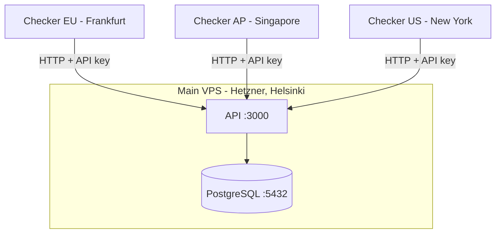

# Argus

A small distributed service monitor I'm building as a portfolio backend development project. The real goal is to learn how a distributed system actually fits together - multi-region checks, consensus, anomaly detection, SLA reporting.

I'm building it phase by phase. Each phase tries to do one thing. Whenever I face limitations, I plan to improve it in the next phase. New features show up when I notice the previous version isn't enough.

## Status

| Phase | Features |
|---|---|
| [Phase 0 - Foundations](#phase-0--foundations) | Monorepo, Fastify API, structured logging, RFC 7807 errors, multi-stage Docker, CI |
| [Phase 1 - Single Checker MVP](#phase-1--single-checker-mvp) | Monitor CRUD, in-process checker, partitioned results, ntfy.sh alerts |
| [Phase 2 - Three Real Checkers](#phase-2--three-real-checkers) | Independent checker processes across 3 regions, API key auth, per-checker alerting |
| [Phase 3 - Windowed Consensus](#phase-3--windowed-consensus) | 2-of-3 majority voting over a 90s window, advisory-lock serialised evaluation, alerts on consensus transitions |

## Architecture



Each checker runs independently - its own scheduler, its own heartbeat loop, its own network path. Results are POSTed to the API as they happen. No coordination between checkers.

## Stack

Node 24 LTS, TypeScript 6 strict, ESM throughout. Fastify, Postgres 17 with raw `pg` (no ORM), Pino, Biome (format + lint), `node-pg-migrate`, multi-stage Docker, GitHub Actions, Husky + commitlint.

## Running locally

Requires Docker Desktop and Node 24.

```bash
git clone https://github.com/YOUR_USERNAME/argus.git
cd argus
docker compose up --build
```

Brings up Postgres, the API on `localhost:3000` (`/health`, `/ready`), and a local checker instance.

---

## Benchmarks

### Phase 3 — consensus suppresses a noisy checker

Target: my Vercel-hosted dev site, monitored by all three checkers at 60s intervals. Impaired `checker-eu` by dropping forwarded TCP 443 from its container for 45s out of every 90s (20 cycles, 30 min). Other two checkers untouched.

| Window           | checker-eu down  | Consensus verdicts | Alerts fired |
|------------------|------------------|--------------------|--------------|
| Control (15 min) | 0 / 15 (0.0%)    | 45 up / 0 down     | 0            |
| Lossy   (30 min) | 10 / 30 (33.3%)  | 105 up / 0 down    | 0            |

All 10 failures were clean 10s `AbortSignal` timeouts. Phase 2 per-checker alerting would have produced ~10 false-positive DOWN+RECOVERED pairs over the same window.

---

## Engineering Ledger

A running record of decisions I made each phase. Entries stay as-written when later phases ship; the log captures the reasoning at the time, not retrospective tidying.

### Phase 0 - Foundations

**Focus:** A deployable backend spine before any feature work. Strict TypeScript, structured logging, RFC 7807 errors, multi-stage Docker, and CI from day one.

**What's in place:**

- npm monorepo with four workspaces: `apps/api`, `apps/checker`, `packages/db`, `packages/logger`
- TypeScript 6 strict (`noUncheckedIndexedAccess`, `noImplicitOverride`), ESM throughout
- Fastify API with `/health` and `/ready`; global error handler emits RFC 7807 with request IDs
- Custom `ArgusError` class hierarchy for typed exceptions (`NotFoundError`, `ValidationError`, etc.)
- Pino structured logging with `service` and `env` base fields across all packages
- `withTransaction` helper in `@argus/db` to keep BEGIN/COMMIT out of route handlers
- Multi-stage Docker, both images under 200MB, non-root user
- Docker Compose with healthcheck-ordered startup
- GitHub Actions CI: build & lint, Docker build, smoke test against the built image
- Branch protection; Conventional Commits enforced via Husky + commitlint

**Key decisions and tricky bugs:**

- `pg.Pool` emits an `'error'` event on top of rejecting the query promise when the database disappears. Without a listener, Node treats it as unhandled and crashes the process - bypassing the try/catch inside `ping()`. Added a no-op `pool.on('error', ...)` listener to absorb pool-level errors; query-level errors still propagate to callers.
- `npm run build --workspaces` doesn't respect topological order, so `apps/api` failed to compile in CI before `packages/db` had emitted its `.d.ts` files. Resolved with explicit build ordering in the root script rather than introducing TypeScript project references - `composite: true` setup felt heavy for four workspaces, but I will change it if the project monorepo grows noticeably.
- Each package owns its own environment variables. The API never reads `DATABASE_URL` directly; importing `@argus/db` triggers validation. Avoids duplicated `requireEnv` helpers and keeps the per-package contract explicit.

### Phase 1 - Single Checker MVP

**Focus:** First real feature: a working uptime monitor with push alerts via ntfy.sh. Monitor CRUD routes, an in-process checker scheduled with `setInterval`, and partitioned `check_results` storage.

**What's in place:**

- Monitor CRUD API with Fastify JSON Schema validation and RFC 7807 errors
- `monitors` table with `CHECK (interval_seconds BETWEEN 30 AND 3600)`; `check_results` partitioned by month with current and next month partitions created at migration time
- In-process checker: `setInterval` per monitor, reseeds from DB on startup, resyncs every 60 seconds
- Error classification on fetch failures: `timeout`, `dns_failure`, `connection_refused`, `tls_error`, `http_error`, `network_error` - reads `err.cause.code` not `err.code` because Node's fetch wraps syscall errors in a TypeError
- Alerts on every up↔down transition via ntfy.sh - best-effort, failures logged as warn and never propagated
- Integration tests for all query functions and routes via testcontainers (real Postgres, no mocks)

**Key decisions and tricky bugs:**

- Used `setInterval` instead of pg-boss `schedule`. pg-boss cron has a one-minute minimum granularity; `setInterval` is simpler and has no scheduling overhead for a single-process checker.
- Added `resetPool(connectionString)` to `@argus/db` so integration tests can swap the pool to point at the testcontainers Postgres after module load - only called by tests, never in production.

**Limitations of this phase:**

- Alerting fires on every transition with no debouncing. A 3-second blip produces a DOWN alert and immediately a RECOVERED alert.
- One checker, one network path. A local network issue is indistinguishable from the target being down.
- Partition rollover is manual - partitions are created at migration time. Running out of partitions will cause inserts to fail.
- Authentication is a hardcoded `MONITOR_USER_ID` env var - no real auth.

### Phase 2 - Three Real Checkers

**Focus:** Replaced the in-process checker with three independent checker processes running in Frankfurt, Singapore, and New York. Main VPS on Hetzner, checker droplets on DigitalOcean. Three regions, genuinely independent network paths.

**What's in place:**

- `apps/checker` - standalone Node process. Polls `/internal/checkers/:id/monitors` every 60s, schedules a check per monitor via `setInterval`, POSTs results to `/internal/results`, heartbeats every 60s
- `/internal/*` API surface authenticated with SHA-256-hashed API keys (`X-API-Key` header). One key per checker, scoped to `checker:write`. URL `checkerId` cross-checked against the key's `owner` to prevent impersonation
- `checker_heartbeats` table, partitioned monthly. `api_keys` table with soft-revoke
- `tools/mint-api-key.ts` CLI for issuing new checker keys
- Three independent deploys, parallel matrix in GitHub Actions, one per region. One region failing doesn't block the others
- CI split into parallel `docker-api` and `docker-checker` jobs with scoped GHA cache; `smoke` only waits on `docker-api`

**Key decisions and tricky bugs:**

- SHA-256 for API key hashing instead of bcrypt. API keys are high-entropy random strings - bcrypt's per-row cost is unnecessary and makes key lookup O(n). SHA-256 + unique index gives O(1) lookup with no meaningful brute-force risk given 131-bit entropy keys.
- Removed `app.checker.scheduleMonitor()` calls from the monitor CRUD routes. The real checkers resync every 60s - up to a 60s lag between creating a monitor and the first check is acceptable. Instant scheduling was only needed when the scheduler lived in-process.
- Migrations run inside a throwaway Docker container on the `infra_default` network so the `postgres` hostname resolves correctly. Running `node-pg-migrate` directly on the VPS host fails because the `postgres` hostname is internal to Docker.

**Limitations of this phase:**

- Alerting is per-checker. `checker-eu` reporting DOWN produces one alert; `checker-ap` reporting DOWN produces another. The user does the consensus mentally.
- No retry on a failed `/internal/results` POST. A transient network error drops one data point. Acceptable for an uptime monitor at this scale.
- API key revocation requires running SQL directly on the prod DB. No admin UI.
- Every checker polls every monitor. No sharding or per-region assignment.
- Partition rollover for `check_results` and `checker_heartbeats` is a manual script.
- API traffic is HTTP, not HTTPS. The API port is firewalled on the main VPS to the three checker droplet IPs only (ufw + `ufw-docker` to handle Docker's iptables bypass), so the API key crosses three known point-to-point links rather than the open internet - but it is not encrypted in transit. Adding Caddy + Let's Encrypt is blocked on owning a domain; tracked as the next thing to fix when that lands.

### Phase 3 - Windowed Consensus

**Focus:** A check verdict is decided by majority agreement across checkers within a recent time window, not by whichever checker wrote last. One checker having a bad network path no longer produces alerts on its own.

**What's in place:**

- `evaluateConsensus` runs on every result write. Takes a per-monitor `pg_try_advisory_xact_lock(hashtext(monitor_id))`, reads the most-recent result per checker within a 90-second window (`DISTINCT ON (checker_id)`), intersects with checkers that heartbeated in the last 2 minutes, and computes a verdict: `up` / `down` / `degraded` / `insufficient_data`
- Majority rule: with 3 checkers, 2-of-3 decides. With 2, only a unanimous pair is callable - a split is `degraded`. With 1, the lone vote stands at low confidence
- Verdict persisted to a denormalised `monitors.last_consensus`; surfaced on `GET /v1/monitors/:id` via a Fastify response schema that whitelists public fields
- Alerts moved from per-checker to per-consensus-edge. One DOWN ntfy per real `up→down` cross-checker transition, one RECOVERED per `down→up`. Phase 2's `maybeAlert` and `getLastTwoResultsForChecker` deleted
- Pure `computeConsensus` (unit-tested with literal `WindowResult[]`) split from `evaluateConsensus` (the lock + queries + persist + log shell, integration-tested against a real Postgres via testcontainers)
- Lock contention skips rather than queues: if a second evaluation for the same monitor can't acquire the lock it returns `null` and the next result write re-evaluates

**Key decisions and tricky bugs:**

- Window is 90 seconds, wider than the 60s default check interval. A 60s window would have dropped any checker even slightly late; 90s gives a slow result time to land and tolerates one missed cycle.
- Added a second column `last_alertable_consensus` that only records `up`/`down`. The alert-edge check reads this column, not `last_consensus`. Without it, a transient `up → degraded → down` would have silently consumed the real transition - `degraded` would have overwritten `up` in `last_consensus` and the alert function would have treated `degraded → down` as a first-evaluation and stayed quiet.
- `medianDurationMs` is `number | null`, never `0`. A `0` reads as "responded in 0ms" to anything that later consumes it as a real measurement.
- Heartbeat intersection, not just the window. A checker that wrote a result then died mid-window has its vote dropped - the data is stale and a dead checker shouldn't keep voting.
- `pg_try_advisory_xact_lock` is the right primitive: `_try_` so contention skips rather than queues, `_xact_` so the lock auto-releases on COMMIT/ROLLBACK and can't leak. Both consensus queries and the UPDATE take `PoolClient` as their first parameter so the type system enforces "run on the same connection that holds the lock" - using the module-level `query` helper would silently grab a different pooled connection.
- `evaluateConsensus` runs in a separate transaction from `insertCheckResult`. The insert commits first so the new row is visible to the consensus window query.
- First-evaluation rule: a brand-new monitor whose target is already down does not alert until it has first recorded an `up`. Stops noisy alerts on creation when a target happens to be broken at the moment a monitor is added.

**Limitations of this phase:**

- This is majority voting, not consensus in the Paxos/Raft sense. No leader election, no log replication. Tolerates one checker failing or having a bad network path; would not survive two simultaneous failures.
- Alerts still fire on every consensus change. A genuinely flapping service - one that really does bounce up/down every 30 seconds - produces an alert per bounce. Removed single-checker false positives but does not yet debounce real flap.
- The 90-second window has an edge. A checker slow enough to land its result *outside* the window gets evaluated with one fewer vote - a 3-checker monitor momentarily decided 2-of-2.
- No consensus history. Only the latest verdict is stored, in two denormalised columns. `check_results` remains the source of truth and historical verdicts have to be recomputed.
